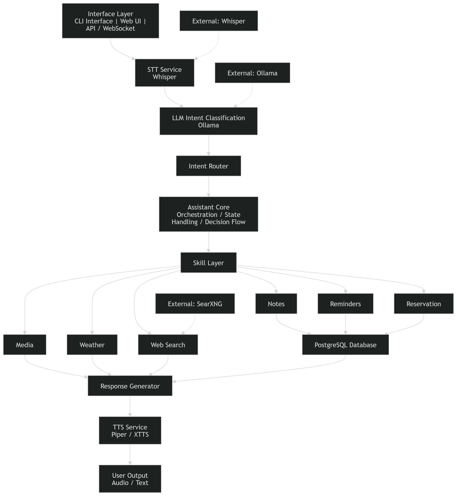

# Jarvis Platform

A modular Turkish AI assistant platform supporting voice, text, and API-based interaction.

This project combines speech recognition, local LLM-based intent classification, multi-skill routing, and text-to-speech synthesis into a single extensible system.

---

## 🧠 Architecture

---

## 🚀 Features

- 🎤 Speech-to-Text (Whisper-based)
- 🧠 Local LLM intent classification (Ollama)
- 🔊 Text-to-Speech (Piper / XTTS)
- 🧩 Modular skill system:
  - Notes & reminders
  - Media control (YouTube, etc.)
  - Web search (SearXNG / fallback)
  - Weather information
  - Reservation workflows
- 🌐 WebSocket & API support
- 🖥️ CLI-based assistant interface
- 🗄️ PostgreSQL-backed persistence
- 🔁 Context-aware conversation flow

---

## 🧠 Architecture
User (Voice / Text)
↓

STT Service (Whisper)
↓

LLM Intent Classification (Ollama)
↓

Intent Router
↓

Skill Layer

├── Media

├── Weather

├── Notes

├── Reminders

├── Reservation

└── Web Search (SearXNG)
↓

Database (PostgreSQL)
↓

Response Generator
↓

TTS Service (Piper / XTTS)
↓

User Output (Audio/Text)

---

## 📁 Project Structure

app/ → Entry points (CLI, WebSocket)

core/ → Core assistant logic & routing

services/ → LLM, STT, TTS, search, etc.

skills/ → Feature modules

api/ → FastAPI endpoints

database/ → DB models & repository

clients/ → External integrations (Ollama, Whisper)

tools/ → Model & patch utilities

tests/ → Test suite

docs/ → Documentation

---

## ⚙️ Installation

### 1. Clone repo

git clone https://github.com/KAlpAkbaba/jarvis-platform

cd jarvis-platform

### 1. 2. Setup environment
python -m venv venv

venv\Scripts\activate   # Windows

pip install -r requirements.txt

###3. Configure environment

POSTGRES_DB=jarvis_db

POSTGRES_USER=postgres

POSTGRES_PASSWORD=your_password

OLLAMA_HOST=http://localhost:11434

🐳 Run with Docker
docker-compose up -d

Services:

PostgreSQL

SearXNG (local search engine)

▶️ Running the Assistant

CLI mode

python app/main.py

API mode

python api/server.py

Then open:

http://localhost:8000

🔎 Example Commands

"Yarın saat 2'de toplantı hatırlat"

"Tarkan çal"

"İstanbul hava durumu"

"Not al market alışverişi"

"Ankara'ya uçak bileti"

🧪 Testing

pytest tests/

🛠️ Technologies

Python

FastAPI

Ollama (LLM)

Whisper (STT)

Piper / XTTS (TTS)

PostgreSQL

SearXNG (self-hosted search)

Docker

📌 Roadmap

 User authentication
 
 Multi-language support
 
 Mobile interface
 
 Plugin system
 
 Real-time streaming audio
 
 AI memory improvements
 

 ⚠️ Notes

 
Requires local model setup (Whisper, Ollama, TTS)

Some features depend on external services

Optimized for Turkish language use

👤 Author

Developed by Kadir Alp Akbaba
